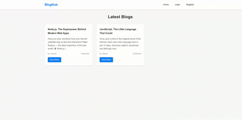
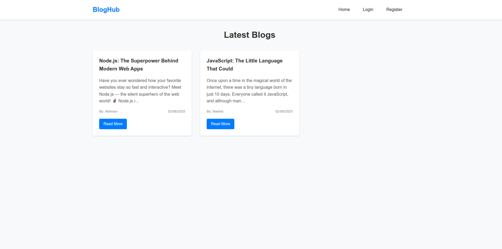
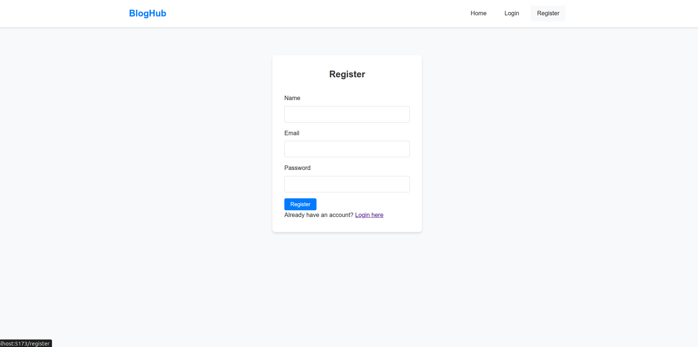
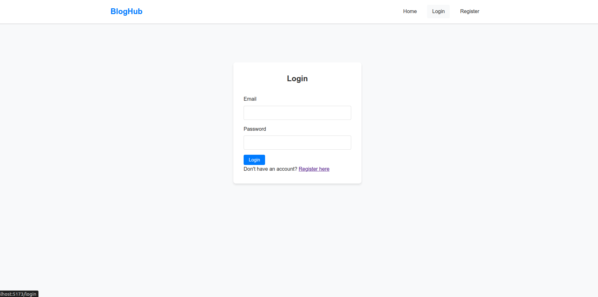
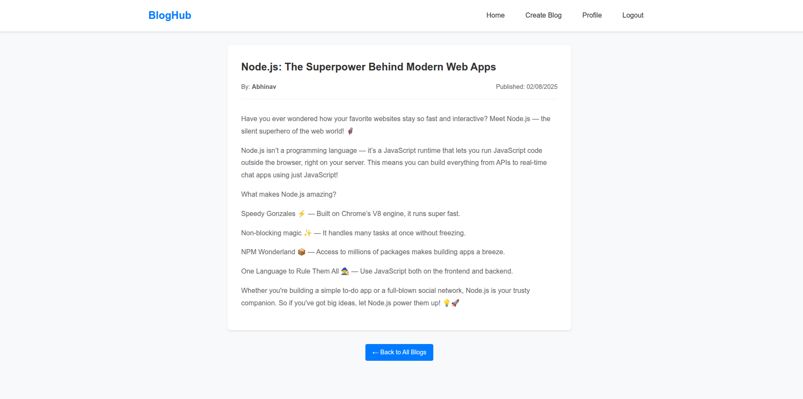
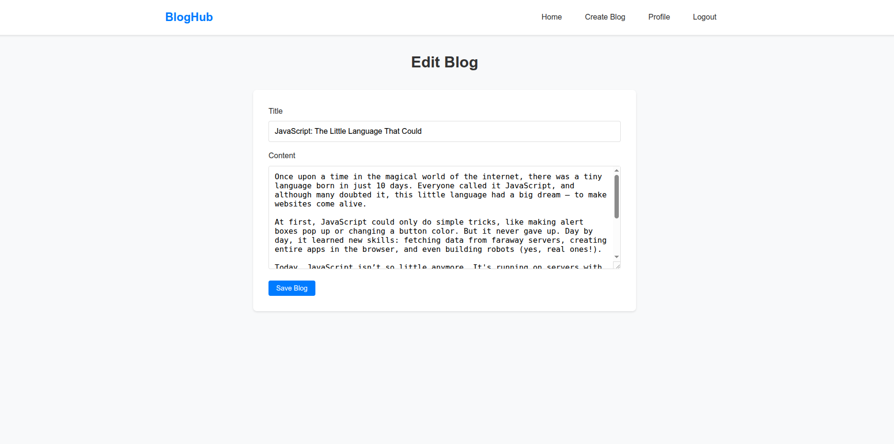
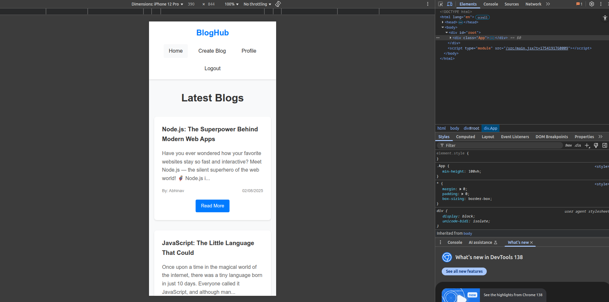

# BlogHub Frontend - React.js Blogging Platform

A modern, responsive frontend for the BlogHub blogging platform built with React.js, featuring JWT-based authentication and comprehensive blog management functionality.

## 📋 Features

### User Authentication (JWT-based)
- ✅ **User Registration** - Account creation with email/password validation
- ✅ **User Login** - Secure JWT-based authentication 
- ✅ **User Logout** - Clean session termination
- ✅ **Protected Routes** - Route-level authentication guards

### Blog Management
- ✅ **View All Blogs** - Browse paginated blog posts
- ✅ **Single Blog View** - Detailed blog post display
- ✅ **Create Blog Post** - Rich blog creation interface
- ✅ **Update Blog Post** - Edit own posts with author authorization
- ✅ **Delete Blog Post** - Remove own posts with confirmation
- ✅ **Author-only Actions** - Authorization checks for CRUD operations

### User Profile Management
- ✅ **View Profile** - Display user information and statistics
- ✅ **My Posts Dashboard** - Manage authored blog posts
- ✅ **Profile Updates** - Edit user profile information

## 🛠️ Tech Stack

- **React.js 18** – Frontend framework with functional components & hooks
- **React Router DOM** – Client-side routing and navigation
- **Axios** – HTTP client for API communication
- **React Context API** – Global state management for authentication
- **JWT** – JSON Web Tokens stored securely in localStorage
- **CSS3/SCSS** – Modern styling with responsive design
- **React Hooks** – useState, useEffect, useContext, useNavigate

## 📁 Project Structure

```
src/
├── assets/              # Static assets and images
├── components/          # Reusable UI components
│   ├── BlogCard.jsx     # Blog post preview card
│   ├── BlogForm.jsx     # Blog creation/edit form
│   └── Navbar.jsx       # Navigation with auth status
├── context/             # React Context providers
│   └── AuthContext.jsx  # Authentication state management
├── pages/               # Page-level components
│   ├── BlogView.jsx     # Single blog post view
│   ├── CreateBlog.jsx   # Create new blog post
│   ├── EditBlog.jsx     # Edit existing blog post
│   ├── Home.jsx         # Home page with all blogs
│   ├── Login.jsx        # User login page
│   ├── Profile.jsx      # User profile and dashboard
│   └── Register.jsx     # User registration page
├── services/            # API service functions
│   └── api.js           # Axios configuration and API calls
├── App.jsx              # Main application component
├── index.jsx            # React DOM entry point
└── App.css              # Global application styles

screenshots/             # UI screenshots (for README)
demo/                    # Demo video files
docs/                    # Additional documentation (optional)
```

## ⚡ Quick Start

### Prerequisites
- Node.js (v16 or higher)
- npm or yarn package manager
- Running BlogHub Backend API

### Installation & Setup

1. **Clone the repository**

```bash
git clone https://github.com/Nashid-k/bloghub-frontend.git
cd bloghub-frontend
```

2. **Install dependencies**

```bash
npm install
```

3. **Environment Configuration**

Create a `.env` file in the root directory with these variables:

```env
REACT_APP_API_URL=http://localhost:5000/api
REACT_APP_APP_NAME=BlogHub
REACT_APP_VERSION=1.0.0
```

4. **Start development server**

```bash
npm start
```

Access the application at [http://localhost:3000](http://localhost:3000)

## 🔧 Environment Variables

| Variable             | Description                   | Default Value               |
|----------------------|-------------------------------|-----------------------------|
| `REACT_APP_API_URL`  | Backend API base URL           | `http://localhost:5000/api` |
| `REACT_APP_APP_NAME` | Application display name       | `BlogHub`                   |
| `REACT_APP_VERSION`  | Application version            | `1.0.0`                     |

## 📱 API Integration

### Authentication Endpoints

- `POST /api/auth/register` – User registration
- `POST /api/auth/login` – User login (returns JWT)
- `POST /api/auth/logout` – User logout

### Blog Management Endpoints 

- `GET /api/blogs` – Fetch all blog posts
- `GET /api/blogs/:id` – Fetch single blog by ID
- `POST /api/blogs` – Create new blog (auth required)
- `PUT /api/blogs/:id` – Update blog (author only)
- `DELETE /api/blogs/:id` – Delete blog (author only)

### User Profile Endpoints

- `GET /api/users/me` – Get current user profile

## 🎥 Demo

### 🎬 Full Application Demo



*The demonstration includes:*  
- Complete user registration and authentication flow  
- Creating, reading, updating, and deleting blog posts  
- User authorization and security features  
- Responsive design across different devices  
- Error handling and user feedback mechanisms

## 📸 Screenshots

### 1. Home Page - All Blogs  
  
*Discover all published blog posts with a clean, responsive layout.*

### 2. User Registration  
  
*Secure user registration with form validation and error handling.*

### 3. User Login  
  
*Streamlined authentication with remember me functionality.*

### 4. User Profile & Dashboard  
  
*Comprehensive dashboard showing profile information and authored blog posts.*

### 5. Create New Blog Post  
  
*Intuitive blog creation interface with rich text editing capabilities.*

### 6. Single Blog View  
  
*Detailed blog post view with author information and interaction options.*

### 7. Edit Blog Post  
  
*Seamless editing experience for blog authors with save/cancel options.*

### 8. Mobile Responsive Design  
  
*Fully responsive design optimized for mobile devices.*

## 🔐 Security Features

- **JWT Token Management** – Secure token storage and automatic refresh  
- **Route Protection** – Private routes with authentication guards  
- **Authorization Checks** – User authorization for content modification  
- **Input Validation** – Client-side form validation and sanitization  
- **Error Handling** – Comprehensive error messages and fallbacks  
- **CORS Configuration** – Proper cross-origin request handling

## 🎨 UI/UX Features

- Responsive Design – Mobile-first layout with CSS Grid and Flexbox  
- Loading States – Skeleton loaders and spinners for better UX  
- Error Boundaries – Graceful error handling with user-friendly messages  
- Form Validation – Real-time validation with visual feedback  
- Intuitive Navigation – Routing with breadcrumbs and back buttons  
- Accessibility – WCAG 2.1 compliance using semantic HTML and ARIA labels

## 🚀 Build & Deployment

### Development Build

```bash
npm install
npm start
npm test
```

### Production Build

```bash
npm run build
npx serve -s build
```

### Deployment Options

**Vercel (Recommended):**

```bash
npm install -g vercel
vercel --prod
```

**Netlify:**

```bash
npm run build
npm install -g netlify-cli
netlify deploy --prod --dir=build
```

**GitHub Pages:**

```bash
npm install --save-dev gh-pages
npm run build
npm run deploy
```

## 📦 Dependencies

### Core Dependencies

```json
{
  "react": "^18.2.0",
  "react-dom": "^18.2.0",
  "react-router-dom": "^6.8.0",
  "axios": "^1.3.0"
}
```

### Development Dependencies

```json
{
  "react-scripts": "5.0.1",
  "@testing-library/react": "^13.4.0",
  "@testing-library/jest-dom": "^5.16.0"
}
```

## 🧪 Testing

```bash
npm test             # Run all tests
npm test -- --coverage  # Run tests with coverage report
npm test -- --watch  # Run tests in watch mode
```

## 🔄 Available Scripts

- `npm start` – Start development server
- `npm run build` – Create optimized production build
- `npm test` – Run test suite
- `npm run eject` – Eject from Create React App (irreversible)

## 🤝 Contributing

1. Fork the repository  
2. Create your feature branch (`git checkout -b feature/AmazingFeature`)  
3. Commit your changes (`git commit -m 'Add some AmazingFeature'`)  
4. Push to the branch (`git push origin feature/AmazingFeature`)  
5. Open a Pull Request

## 📄 License

This project is licensed under the MIT License — see the [LICENSE](LICENSE) file for details.

## 👨💻 Author

**Nashid K**  
- GitHub: [@Nashid-k](https://github.com/Nashid-k)  
- Email: nashidk1999@gmail.com  
- LinkedIn: [Nashid K - Full Stack Developer](https://www.linkedin.com/in/nashid-k-080909273/)

## 🙏 Acknowledgments

- React.js team for the incredible framework  
- Create React App for seamless setup  
- JWT.io community for best practices in authentication  
- Open Source community inspirations  
- Sinope Technologies for the project opportunity  

## 📞 Support & Contact

For questions, issues, or support:

1. **GitHub Issues:** Open an issue in this repository  
2. **Email Support:** nashidk1999@gmail.com  
3. **Documentation:** See `/docs` folder for additional guides

**⚠️ Important:** This frontend application requires the BlogHub backend API to be running. Make sure your backend is deployed and `REACT_APP_API_URL` points to the correct API endpoint.

## 📧 Project Submission

This project was developed as part of a technical assessment for **Sinope Technologies**.

- **Developer:** Nashid K  
- **Project:** BlogHub - MERN Stack Blogging Platform  
- **Submission Date:** August 3rd, 2025  
- **Contact:** nashidk1999@gmail.com
